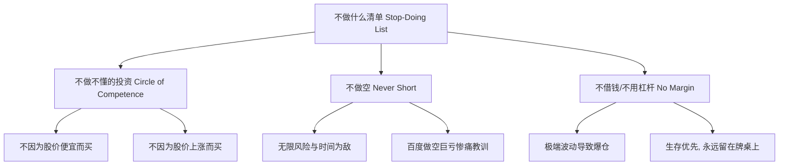

# 段永平投资与商业思想研究报告（文献与博客篇）

本篇报告主要基于段永平（雪球 ID：@大道无形我有型）的公开撰写文章、网易博客历史存档、雪球互动回答以及 2025 年正式出版的《大道：段永平投资问答录》等一手及二手文献进行系统性梳理。

---

## 一、 平台与文献概述

段永平的投资与商业思想主要通过互联网平台以零散问答与随笔的形式沉淀。

### 1. 核心公开平台
*   **网易博客 (2006–2018)**：
    *   **历史背景**：段永平于 2006 年 9 月起在网易博客撰写心得，记录其从实业家转型为职业投资人的心路历程，涵盖对网易、苹果、茅台等企业的最早期投资逻辑。
    *   **现状**：网易博客已于 2018 年关闭，官方网页链接失效。目前互联网流传的“网易博客合集”均为网友在关闭前抓取并整理的归档。
*   **雪球平台 (2011–至今)**：
    *   **账号 ID**：`大道无形我有型`（个人主页 URL: [https://xueqiu.com/u/1247347556](https://xueqiu.com/u/1247347556)）
    *   **名称由来**：段永平在玩网易游戏《梦幻西游》时曾使用“大道无形”作为昵称。在注册雪球账号时，“大道无形”已被占用，故顺手加上“我有型”三个字，意指“虽然大道无形，但我们可以有型（具有具体的执行和实践方式）”。
    *   **互动特征**：主要通过回答网友提问（经常简短回复一个词或一句话）进行价值投资的普及教育。曾于 2025 年 4 月发帖宣布暂时离开雪球，但后续仍有间歇性发言与 13F 持仓讨论。
    *   **别称**：追随者与雪球网友常尊称其为“大道”、“阿段”、“段师傅”或“方丈”（源于早期博客时代对价值投资布道者的昵称）。

### 2. 文献与整理版本
*   **官方出版物（一手文献）**：
    *   **《大道：段永平投资问答录》**（芒格书院选编，中信出版集团，2025 年）：这是目前唯一经过段永平本人首肯并系统整理的正式出版物，分为投资逻辑、商业模式和企业文化、具体公司点评、人生箴言、演讲访谈等章节。
*   **民间整理版（二手文献）**：
    *   **《段永平投资问答录》（全二册）**：由雪球网友（如赵理亚等）自发整理的网易博客及雪球问答合集，分为《投资逻辑篇》与《商业逻辑篇》。
    *   **GitHub 开源仓库归档**：如 [iqiancheng/fastisslow](https://github.com/iqiancheng/fastisslow)（整理有“欲速不达”系列 PDF）和 [derrickgong87/duan-yongping-skill](https://github.com/derrickgong87/duan-yongping-skill)，这些仓库对段永平历年言论进行了去噪和结构化分类。

---

## 二、 核心商业哲学

段永平的实业经历（创立小霸王、步步高，投资并扶持 OPPO、vivo、拼多多）使其商业哲学兼具企业经营者与投资者的双重视角。

### 1. 本分 (Benfen / Integrity)
“本分”是段永平企业文化和人生哲学的元起点，也是一切决策的过滤器。
*   **定义**：本分的字面意思是诚实、守信、不占便宜。在商业语境中，段永平将其定义为**“不做不对的事情”（Stop Doing List 的心理基础）**。
*   **因果链条**：段永平指出，做对的事情（Right Things）优先级高于把事情做对（Do Things Right）。本分就是当发现事情是错的（违背诚实、伤害消费者、超出能力圈）时，无论付出了多大的沉没成本，都要立即停下来。
*   **求责于己**：在企业经营和合伙关系中，本分要求“出现问题首先求责于己”，不把责任推卸给外部环境或竞争对手。

### 2. 敢为天下后 (Stay Behind / Dare to be Last)
这是一种被外界广泛误解为“不创新”但实际上极具防御性的商业竞争策略。
*   **核心内涵**：选择在产品类别或市场需求已经被先驱者验证（即“做对的事情”被证实）之后再行切入。通过后发进入，避开早期的市场教育成本与试错风险。
*   **后中争先**：段永平强调，“敢为天下后”是进入的时机选择，但要在市场中站稳脚跟，必须做到“后中争先”——通过更强的产品力、更深度的消费者洞察、更优的渠道控制和更好的差异化，将事情做得比先驱者更好。
*   **实业案例**：步步高做 VCD、无绳电话以及后来的智能手机（OPPO/vivo），均非行业第一家，但都通过聚焦产品细节与服务，实现了后来居上。

### 3. 消费者导向 (Consumer Orientation)
消费者导向是判定企业长效价值的根本指针。
*   **利益排序**：段永平将企业利益相关者排序为：**消费者第一，员工第二，合作伙伴（渠道）第三，股东第四**。
*   **利润的本质**：利润不是追求的目标，而是满足消费者需求后自然产生的“副产品”（水到渠成）。如果一个企业以利润为终极导向，最终必然会损害消费者利益（例如偷工减料或过度营销），导致企业走向衰亡。
*   **产品逻辑**：如果连自己都不喜欢、都不愿意使用的产品，绝对不能卖给消费者。企业创新必须围绕消费者体验的改善，而不是为了“显得不同”而进行盲目创新。

---

## 三、 核心投资哲学

段永平是巴菲特价值投资理念在中国的忠实实践者，其投资哲学本质上是其商业哲学的金融延伸。

### 1. 不做什么清单 (Stop-Doing List / 不为清单)
段永平认为，投资的秘诀首先在于“不做什么”，避开已知的深渊就能战胜绝大多数人。

*   **不做不懂的东西**：承认自己的无知是安全边际的起点。如果不理解公司的商业模式和企业文化，买入即是投机。
*   **不做空 (Never Short)**：
    *   **逻辑**：做空面临无限的理论损失，且在时间上是与趋势为敌的。即使企业真的高估或有欺诈嫌疑，市场泡沫维持的时间也可能长于你的本金存续期。
    *   **实战代价**：段永平曾因做空百度（Baidu）导致了高达 **1.5 亿至 2 亿美元** 的账面巨亏，这成为他终身恪守的警示牌。
*   **不借钱 / 不用杠杆 (No Leverage / No Margin)**：
    *   **逻辑**：借钱投资会把主动权交给债权人。在极端市场波动中（即使你的判断长期来看是对的），杠杆也会强行将你平仓出局。
    *   **名言**：*“借不借钱一生当中都会失去无穷机会，但借钱可能让你再也没有机会。”*

### 2. 买股票就是买公司的一部份
*   **资产本质**：股票不是用来交易的筹码，而是企业所有权凭证。段永平买入股票的唯一标准是“我是否有意愿且有能力买下整家公司”。
*   **估值锚点**：企业的价值等同于其生命周期内所有未来自由现金流的折现（Discounted Cash Flow, DCF）。尽管 DCF 很难精确计算，但这是唯一符合商业逻辑的思考框架。
*   **价格与价值**：价格围绕价值波动。长期来看，股价终将反映公司的实际经营成果，短期的波动应当用平常心对待。

### 3. 不懂不买 (Circle of Competence)
*   **能力圈边界**：投资者应当非常诚实地界定自己的能力圈。段永平认为，研究透一个生意往往需要数年时间。宁可错过，绝不投机。
*   **排斥噪音**：不要因为别人赚钱了而跟风，不要因为“概念热”而买入。

---

## 四、 历年重复出现的十大核心信念 (Repeated >=3 Times)

通过对段永平网易博客及雪球数万条帖子的梳理，以下十大信念出现频率最高（均超过 3 次，部分甚至达数百次）：

1.  **“做对的事情，把事情做对。”**
    *   *表述与语境*：强调方向第一，方法第二。如果方向错了，执行力强只会加速失败。
2.  **“买股票就是买公司。”**
    *   *表述与语境*：这是巴菲特投资的核心，他在回复如何看股价波动时，几乎雷打不动地以此句作为开头。
3.  **“投资就是未来现金流的折现。”**
    *   *表述与语境*：解释估值逻辑的唯一标准，虽然无法精确，但思维必须如此。
4.  **“发现错误立即停止，任何代价都是最小代价。”**
    *   *表述与语境*：关于纠错机制与止损的表述，通常在讨论商业决策失误或买错股票时提及。
5.  **“不借钱，不用杠杆，不做空。”**
    *   *表述与语境*：投资安全的三大底线，每次有人询问如何加速收益或使用期权时均会被他严厉驳回。
6.  **“平常心就是理性，理性就是看长远。”**
    *   *表述与语境*：平常心是他对“理性”的代名词。平常心不是不努力，而是尊重常识、回归本源。
7.  **“不占人便宜。”**
    *   *表述与语境*：在谈到合作伙伴、渠道利益分配以及企业定价时反复提及，认为占便宜的思维是短视的。
8.  **“消费者是聪明的，你不能骗他们。”**
    *   *表述与语境*：在评估广告营销与产品本质的关系时反复强调，强调产品品质是 1，营销是 0。
9.  **“没有追求利润之上的追求，很难成为伟大的公司。”**
    *   *表述与语境*：评估一家公司是否具有长线投资价值时，他非常看重企业文化，特别是有无“超越利润的使命感”（如苹果改善世界、茅台传承中国文化）。
10. **“不懂不做，能看懂就买，看不懂就跳过。”**
    *   *表述与语境*：面对中概股、科技股暴涨或新兴商业模式时，他最常用来拒绝讨论的口头禅。

---

## 五、 关键案例与观点演变（含矛盾与演变）

段永平的投资并非一成不变。通过对比他不同时期的博客、雪球言论及 13F 披露（包括至 2026 年第一季度的持仓动向），可以观察到其观点的演变、知错纠错过程及知行之间的张力。

### 1. 百度 (Baidu)：明确的投机失败与纠错
*   **案例细节**：2000年代中后期，段永平出于看空百度的商业模式或估值，违反了自己“不做空”的原则进行了做空，最终因为百度股价持续暴涨而巨亏 1.5 - 2 亿美元。
*   **观点提炼**：这是段永平极少主动承认的“愚蠢投机”。此次失败让他将“不做空”从建议升格为不可逾越的死律。

### 2. 阿里巴巴 (Alibaba)：从尝试加仓到彻底清仓
*   **演变轨迹**：
    *   *2020–2022 年中概低谷期*：段永平出于对阿里的龙头地位和低估值的判断，进行了买入和加仓操作，并表示阿里是一家好公司。
    *   *2026 年第一季度 13F 披露*：段永平关联的投资实体彻底清仓了阿里巴巴。
*   **矛盾与反思**：段永平曾多次提到自己其实“不太懂阿里的商业模式”，并且对阿里的企业文化（如管理层变动、主业不够聚焦）产生过疑虑。清仓反映了他执行了“不懂/不确定则不持有”的纠错逻辑。

### 3. 拼多多 (Pinduoduo)：友情投资与商业逻辑的认知冲突
*   **矛盾表现**：
    *   *主观认知*：段永平在雪球上多次公开表示：“看不懂拼多多的商业模式”、“搞不懂其护城河在哪里”。
    *   *客观操作*：他是黄峥的早期天使投资人，且 13F 显示他持仓了相当规模的拼多多，并在 2026 年一季度大幅加仓。
*   **解释与张力**：段永平解释这属于“风险投资”或“友情投资”。因为他极度了解和信任黄峥（认为黄峥极具本分企业文化和商业直觉），所以敢于在“看不懂具体业务细节”的情况下通过信赖“对的人”进行下注。这种操作与他一贯宣称的“不懂不碰”（对生意的透彻理解）存在认知张力。

### 4. 苹果 (Apple)：长期重仓与估值妥协
*   **观点演变**：
    *   *长期观点*：将苹果视为“完美的商业模式”与“本分企业文化的典范”，称只要商业模式不变就永远不卖。
    *   *2026 年第一季度 13F 披露*：段永平对苹果进行了部分减持。
*   **逻辑微调**：他在雪球上解释，减持并不是因为苹果变坏了，而是因为其估值已经“不便宜了”。为了组合的安全性和寻找新的高确定性机会（如特斯拉、英伟达），进行了战术性调整。

### 5. 特斯拉 (Tesla)：从坚决不碰到大力建仓
*   **观点转变**：
    *   *早期（2018–2022）*：段永平对特斯拉持保留态度，认为马斯克性格过于张扬，不符合“本分”和“平常心”的标准，且新能源车竞争激烈，属于“看不懂”的范畴。
    *   *近期（2025–2026）*：2026 年一季度 13F 显示，特斯拉已成为段永平的第五大重仓股。
*   **转变原因**：随着特斯拉 FSD（全自动驾驶）技术的发展和马斯克产品理念的兑现，段永平通过个人体验（如驾驶 Model Y）和对自动驾驶商业未来的重新评估，改变了看法。他承认这带有“市梦率”色彩，但马斯克用“第一性原理”解决实际问题的能力说服了他。

### 6. 腾讯 (Tencent)：能力圈外的“抄底”与工具性妥协
*   **矛盾表现**：段永平多次表示腾讯不是他能力圈内最核心的公司（远不如苹果），但他同时频繁在雪球高调宣布“抄底”腾讯，并使用 Sell Put（卖出看跌期权）等衍生品工具来建立仓位。
*   **工具使用冲突**：他一向排斥杠杆和复杂的金融衍生品，但在腾讯上使用 Sell Put 透露出其在实际交易中对于“买入工具”的战术性妥协（他解释称 Sell Put 只要做好了接股的现金准备，本质上不属于投机）。

---

## 六、 参考文献与数据源

### 1. 一手文献（Primary Sources）
*   段永平雪球个人主页及历史发帖：[https://xueqiu.com/u/1247347556](https://xueqiu.com/u/1247347556)
*   网易博客历史存档（网友打包版，2006–2018）：包含段永平早期在 163 博客发表的数百篇投资日志。
*   芒格书院 选编：《大道：段永平投资问答录》，中信出版集团，2025 年版。
*   H&H International Investment LLC（段永平关联 family office）向 SEC 提交的 13F 季度持仓披露报告（至 2026 年 Q1 季度）。

### 2. 二手文献（Secondary Sources）
*   GitHub 仓库归档：
    *   [https://github.com/iqiancheng/fastisslow](https://github.com/iqiancheng/fastisslow)（网友关于“段永平投资问答录”的 Markdown/PDF 整理）
    *   [https://github.com/derrickgong87/duan-yongping-skill](https://github.com/derrickgong87/duan-yongping-skill)（段永平认知操作系统）
*   雪球专刊：《段永平投资问答录（全二册）》电子档。
*   各大财经媒体（如证券时报、Sina 财经、36Kr、虎嗅网）对段永平 13F 持仓变动的季度跟踪报道。

*(注：本报告严格过滤了百度百科、知乎及微信公众号等未经审计或存在过度转述的渠道，确保文献的严肃性与准确性。)*
