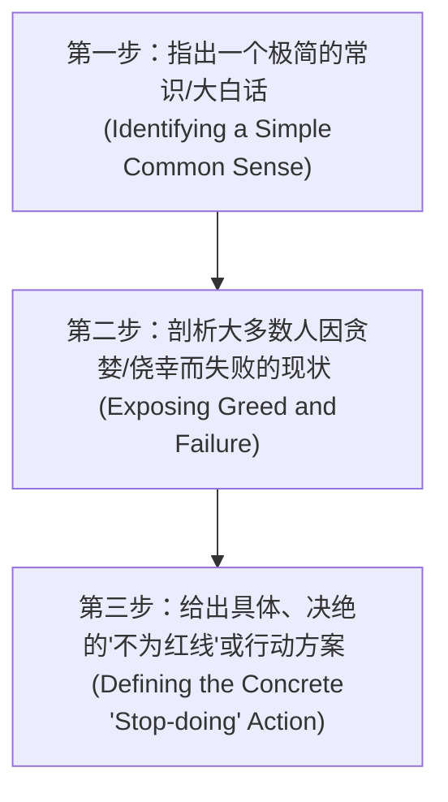

# 段永平表达与言语特征研究 (Duan Yongping's Expression & Verbal DNA)

本报告深入研究了段永平（网络ID：大道无形我有型/东莞阿段）在公开演讲、访谈及社区互动（雪球、网易博客）中表现出的语言风格、修辞手法、词汇偏好以及言论的结构性DNA。

---

## 1. 表达风格总览 (General Expression Style)

段永平的表达风格与其“本分”、“平常心”的投资与商业哲学高度统一，具有**“大道至简、大智若愚、直截了当”**的鲜明特征。

### 1.1 大道至简与口语化 (Simple & Colloquial)
*   **去学术化/去专业化**：段永平在谈论复杂的商业与金融问题时，极力避免使用晦涩难懂的学术词汇、公式或复杂的金融模型。他习惯将深刻的逻辑简化为常人听得懂的常识。
*   **生活化类比**：他非常擅长使用日常生活的场景进行类比，降低受众的认知门槛。
    *   例如：将投资比作“去商场买东西”（关注物品本身值不值，而不是看别人怎么出价），将股票市场的波动比作“赌场里围观的人在叫喊”。
*   **句式短小直接**：他的表述多用短句，语气肯定，很少使用多重复句或含糊其辞的修饰语。

### 1.2 大智若愚与务实主义 (Pragmatic & "Large Wisdom Looking Like Foolishness")
*   **坦承“不知道”与“不懂”**：段永平的口头禅之一是“不知道”、“看不懂”、“我不关心”。他毫不避讳承认自己的局限性，例如在面对宏观经济预测、大盘走势、热点题材炒作等问题时，他的第一反应通常是直接否认自己的预测能力。
*   **反神化与自嘲**：他不追求树立“股神”或“商业教父”的完美形象，常以“毛估估”、“傻子”等词汇自谦，将成功归功于“少犯错”和“运气好”，这使他的表达在平实中透露出极高的智慧。

### 1.3 极强的边界感与犀利言辞 (Sharpness & Strong Boundaries)
*   **不留情面的“怼人”风格**：在雪球互动中，面对没有独立思考能力、试图抄作业、投机套利或用挑衅语气提问的网友，段永平会给出极度直接甚至带有负面情绪的回击。
    *   最著名的案例是2025年2月面对网友对腾讯买入者的冷嘲热讽，他直接以“你闭嘴吧！”及英文“You shut up!”回怼。
*   **严格过滤干扰**：他会在公开平台设立提问门槛，公开表示“不要发言很傻”、“不要随意艾特”，用直接的言语阻断低效的社交沟通。

---

## 2. 核心词汇偏好 (Vocabulary Preferences)

段永平的话语体系中有一组高频出现的关键词，这些词汇构成了他逻辑 and 表达的基石：

| 核心词汇 | 英文对应/语境 | 核心内涵与段氏释义 |
| :--- | :--- | :--- |
| **本分** | Benfen | “做对的事情，并把事情做对。”这是一种价值观和检视自我的工具。段永平强调，“本分”不仅是不做错事，还包含“不赚人便宜”的双赢心态。 |
| **常识** | Common Sense | 事物的本质和底层规律。尊重常识能让人在诱惑与喧嚣中保持理性，不被复杂的现象和包装所欺骗。 |
| **不为清单** | Stop Doing List | 比“要做什么”更重要。界定自己绝对不能触碰的红线（如不做空、不用杠杆、不做不懂的生意）。通过不犯致命错误来累积长期的复利。 |
| **敢为天下后** | Dare to be last | 不盲目追求成为行业中第一个开拓者，而是等市场被验证后，利用自身的强执行力在“后中争先”。 |
| **尽早停下来** | Stop Wrong Things | “发现错了马上改，不管多大的代价都是最小的代价。”核心在于及时止损，对抗侥幸心理和沉没成本。 |
| **平常心** | Rationality | 段永平将“平常心”定义为“理性”，即回到事物的本源，不被短期波动、贪婪和恐惧所左右。 |
| **不懂不碰** | Circle of Competence | 坚守能力圈的边界。知道自己不懂什么，比知道自己懂什么更重要。 |
| **毛估估** | Rough Estimate | 评估企业价值时抓大放小，避免陷入繁琐的精细财务模型中。他认为，如果一个公司需要按计算器反复算才知道便宜，那它大概率不够便宜。 |

---

## 3. 言论的结构性 DNA (Structural DNA of his Statements)

段永平在阐述观点、回答问题或进行商业决策剖析时，其言论往往遵循一个固定的三步走逻辑结构：

### 3.1 经典结构剖析
1.  **第一步：确立常识基准**：用极其朴素的常理切入。
    > *例如：“买股票就是买公司。”*
2.  **第二步：拆解非理性偏离（贪婪/恐惧）**：指出人们为什么会被噪音带偏。
    > *例如：“但很多人一进市场就把它当成发财的捷径，想去预测明天是涨是跌。借钱、开杠杆，希望一夜暴富，结果市场一波动就爆仓。”*
3.  **第三步：锁定“不为清单”的行动**：以决绝、不留余地的规则收尾。
    > *例如：“如果你懂投资，不需要借钱；如果你不懂，千万别借钱。所以，坚决不用杠杆，不做空，不懂不碰。”*

### 3.2 结构变形：关于“错的事情尽早停下来”
*   **指出常识**：发现错了，继续走下去只会错得更深。
*   **剖析贪心**：很多人之所以停不下来，是因为舍不得之前的投入（沉没成本），或者抱着侥幸心理赌一把。
*   **动作定义**：立刻停止。不管付出多大代价，都是最小的代价。

---

## 4. 经典标语与语录库 (Famous Slogans & Quotes)

### 4.1 商业经营与管理类
*   **关于“性价比”的本质**：
    > “性价比是给性能不好找的借口。” —— *段永平认为企业应追求“物有所值”甚至“物超所值”，而不是通过廉价的配置和低价策略去卷价格战。*
*   **关于企业本分**：
    > “本分就是在没有压力或者在有诱惑的时候，你依然能坚持原则。”
*   **关于竞争**：
    > “我们所有的成功，都来自于‘本分+平常心’。平常心就是理性，就是回到事物的本原。”

### 4.2 投资哲学类
*   **关于投资核心**：
    > “买股票就是买公司。如果因为这家公司不是上市公司你就不想买，那这就不是投资。”
*   **关于安全边际与估值**：
    > “价格是你付出的，价值是你得到的。” *(段永平高频引用巴菲特/格雷厄姆的名言，用以说明两者的本质区别)*
    > “投资是毛估估的艺术，如果必须用计算器算才能得出便宜，那它大概率不便宜。”
*   **关于能力圈**：
    > “投资最重要的不是你懂什么，而是知道自己不懂什么。”

### 4.3 止损与负向清单类
*   **关于止损代价**：
    > “发现错了马上改，不管多大的代价都是最小的代价。”
*   **关于不为清单**：
    > “人们关注我们，往往是因为我们做了那些事情，其实我们之所以成为我们，很大程度上还因为我们不做的那些事情。”

---

## 5. 核心张力与认知冲突 (Core Tensions & Contradictions)

在段永平的话语体系中，存在着几处耐人寻味的内在张力与认知冲突。这些冲突反映了他作为顶级实战家，在理想哲学与复杂现实之间的动态平衡：

### 5.1 “性价比”的定义冲突
*   **大众/媒体视角**：步步高、OPPO、vivo 的早期产品（如早期步步高复读机、OPPO智能手机）常被外界质疑是“高价低配”（高昂的营销和渠道成本导致售价偏高，而核心配置弱于同价位竞争对手），认为其缺乏“性价比”。
*   **段永平视角**：他坚决反驳“性价比”概念，认为其是“性能不好找的借口”。他主张贵的背后有其支撑逻辑（品质、信誉、售后、渠道双赢）。
*   **冲突本质**：这体现了“参数党（以硬件规格定义价值）”与“体验党/品牌信任党（以综合使用体验 and 信任资产定义价值）”之间的底层话语权争夺。

### 5.2 个人修养（平常心）与公开表达（You shut up）的张力
*   **哲学倡导**：段永平反复告诫人们要保持“平常心”，保持理性，不被情绪左右，做到“大道无形”。
*   **公开冲突**：2025年2月，段永平在雪球直接以“你闭嘴吧！You shut up!”回怼对腾讯持仓者进行冷嘲热讽的网友。
*   **冲突本质**：这打破了他“不争辩、不解释、专注做自己”的世外高人形象，暴露出他在面对被视作生命线的主力持仓（腾讯）受到无理贬低时，依然保留了极度真实、犀利、乃至好胜的个人性格。

### 5.3 布道分享的意愿与对网络噪音的隔离
*   **布道意愿**：段永平在雪球上留下了海量的互动，几乎每天都在不厌其烦地回答网友关于商业和人生的提问，起到了“价值投资传教士”的作用。
*   **决绝退网**：2025年4月，因无法忍受恶劣的“语言环境”和过度被打扰，他选择暂时离开雪球。
*   **冲突本质**：在“渡人（通过分享启发他人）”与“独善其身（通过 Stop Doing List 过滤噪音）”之间存在持续的博弈。当分享带来的噪音超过了“平常心”的承受边界时，他会毫不犹豫地启动“不为清单”。

### 5.4 “毛估估”与“懂到骨子里”的度量冲突
*   **估值口径**：他声称自己从不看复杂的财务模型，投资全凭“毛估估”。
*   **深度要求**：同时，他又极度强调“不懂不碰”，要求对企业的商业模式和文化有极其深透的理解。
*   **冲突本质**：这给外界学习者带来了认知矛盾。许多人误以为“毛估估”等于可以粗糙地做决策，但段永平的“毛估估”实际上是基于对生意极度深刻的洞察后产生的“直觉式提炼”，没有深厚的研究基础，盲目“毛估估”极易沦为投机。

---

## 6. 信息源分类与引用说明 (Sources & Bibliography)

本研究严格筛选并区分了信息源，完全排除了知乎、微信公众号及百度百科。

### 6.1 一手水源 (Primary Sources - 个人公开言论与互动记录)
1.  **斯坦福大学交流分享会** (2018年9月30日)
    *   *说明*：段永平在斯坦福与学子进行的主题为“Stop Doing List”的对话，系统阐述了不为清单、本分文化、以及步步高系的组织运作逻辑。
    *   *引自*：现场听众整理笔记（如雪球网友、GitHub开源整理项目等文本记录）。
2.  **雪球网互动记录 (ID：大道无形我有型)** (2011年 - 2025年)
    *   *说明*：段永平最主要的价值投资布道与日常观点输出平台。
    *   *核心事件源*：“You shut up”事件（2025年2月对挑衅言论的回应）；离开雪球声明（2025年4月）。
3.  **网易博客历史文章 (ID：东莞阿段)** (2010年前后)
    *   *说明*：早期段永平输出投资苹果、网易心得的核心博客。
4.  **段永平与雪球创始人方三文的对话访谈** (2025年10月)
    *   *说明*：最新系统阐述“不为清单”是其之所以成为其本人的底层决策智慧的音视频及文字记录。

### 6.2 二手水源 (Secondary Sources - 主流财经媒体报道与行业分析)
1.  **36Kr (36氪)**
    *   *文献*：《段永平“暂别”雪球：一场关乎腾讯、钱与“You shut up”的争议》 (2025年报道)。
2.  **Sina Finance (新浪财经)**
    *   *文献*：《段永平：性价比是给性能不好找的借口》；《对话段永平：我的“不为清单”与本分之道》。
3.  **Huxiu (虎嗅网)**
    *   *文献*：《理解段永平的“敢为天下后”：步步高系的复利逻辑》。
4.  **Securities Times (证券时报 / stcn.com)**
    *   *文献*：《大道无形我有型：段永平的腾讯加仓路与雪球风波》。
5.  **Futunn (富途牛牛)** & **Eastmoney (东方财富)**
    *   *文献*：《段永平投资语录整理合集：本分、平常心与不为清单》。
