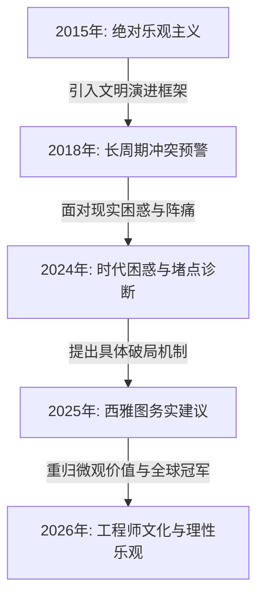

# 李录（Li Lu）长篇对话、演讲与访谈深度研究

## 一、 执行摘要 (Executive Summary)

李录（Li Lu）是喜马拉雅资本（Himalaya Capital）的创始人，也是查理·芒格（Charlie Munger）终身认可的合伙人。在当今全球价值投资界，李录以其独特的“自下而上（Bottom-Up）的微观企业研究”与“自上而下（Top-Down）的文明历史长周期宏观分析”相结合的框架而著称。

### 核心思想演变路径：
1. **微观价值发现阶段（2006 - 2010年）**：以哥伦比亚大学演讲为代表，核心在于阐述传统的 Graham-style 安全边际与“烟蒂股（Cigar Butt）”投资，强调寻找具有深厚资产与现金流的被低估公司（如早期韩股、Timberland），并严格定义“能力圈”的边界。
2. **知行合一与中国适用性阶段（2015 - 2019年）**：以北京大学演讲为代表，核心在于探讨价值投资在中国的具体实践。李录论证了中国市场由于散户化、波动大，反而比美国市场更适合价值投资，同时强调了资产管理行业的“受托人道德底线”与企业家的“乐观坚韧”特质。
3. **宏观文明跨越与堵点诊断阶段（2024 - 2026年）**：以2024年北大光华十周年演讲、2025年西雅图对话及2026年比亚迪专访为代表。李录将视角提升至“3.0科技文明”转型与全球地缘政治重塑的高度，务实地诊断了当前中国经济的“两大堵点”（社会保障体系与资本市场制度），并重申了以比亚迪为代表的中国企业走向全球的理性乐观主义。

---

## 二、 哥伦比亚大学商学院演讲与问答 (2006, 2010)

李录作为哥伦比亚大学的杰出校友（同时获得哥大巴纳德学院/哥大物理/社会学学士、法学博士JD、商学院工商管理硕士MBA），曾多次受邀回到 Bruce Greenwald 教授的价值投资课堂发表客座演讲。

### 1. 2006年哥伦比亚大学演讲（投资大师课）
*   **演讲背景**：被价值投资界誉为“经典大师课”，当时李录管理 Himalaya Capital 约有数年时间，业绩优异。
*   **核心案例分析**：
    *   **Timberland（天伯伦）**：李录在1998年亚洲金融危机爆发后发掘了该公司。当时市场被恐慌情绪笼罩，Timberland虽然利润持续增长且品牌强劲，但估值被无情压低至5-6倍P/E，股价接近账面价值。李录通过“记者式的深度调查”（深度访谈管理层、上下游供应商、零售店员），确信其现金流和品牌韧性并未受损，在极高安全边际下重仓，获得数倍回报。
    *   **Hyundai Department Store H&S（韩国现代百货）**：李录通过最笨的方法——一页一页翻阅标普（S&P）关于韩国股票的厚重手册，发掘了这家估值低至2倍P/E的公司。该公司的账面现金和其在现代集团其他企业中的股权价值，远远超过其当时的总市值。
*   **关于“能力圈”与“安全边际”的阐述**：
    *   **所有者心态**：买入股票就是买入生意的一部分。如果你不能像看待私人小生意一样看待这家上市公司，你就没有资格购买。
    *   **安全边际的刚性需求**：因为作为少数股东，你无法控制公司的资本分配（Capital Allocation）。为了弥补这一控制权缺失，你必须要求极高的价格折扣（安全边际）。

### 2. 2010年哥伦比亚大学演讲
*   **演讲背景**：当时李录正由于帮助芒格管理家族资产、成功促成伯克希尔·哈撒韦重仓比亚迪（BYD），而被传为巴菲特继承人（CIO）的热门人选。
*   **Q&A 重点纪要**：
    *   **中国市场的造假与审计风险**：有学生问及如何在中国等新兴市场防范财务造假。李录回答称，防范造假不依赖审计报告的字面签字，而是依赖极度严苛的微观尽职调查。你必须去工厂数卡车、查电表、拜访竞争对手、了解产业链常识，用常识去检验报表。
    *   **与管理层会面的必要性**：李录表示，虽然与管理层见面是有价值的，但它并不是必须的。如果你能通过公开数据和产业链调研获得足够大且无懈可击的安全边际，即使不见面也完全可以做出投资决策。
    *   **持续学习的机器**：他提到即使对于比亚迪这样已经持有了数年且深度了解的公司，他每天依然能学到新的行业和技术细节，投资是一场没有终点的学习过程。

---

## 三、 北京大学光华管理学院系列演讲 (2015, 2019, 2024)

李录与北京大学光华管理学院共同创办了《价值投资实务》课程，并每隔数年亲自进行系统性讲座。

### 1. 2015年演讲：《价值投资在中国的展望》
*   **核心论点**：
    *   **资产管理行业的受托人责任**：李录指出，资管行业在道德上极度敏感。客户将终生积蓄交给你，而由于金融产品的复杂性，他们无法在短期内判断你是否称职。因此，价值投资人必须严守道德底线，不参与零和博弈。
    *   **价值投资在中国的肥沃土壤**：中国市场具有以下两个特征，使其成为价值投资的乐园：一是中国经济正处于由投资驱动向消费驱动的长期成长中；二是中国市场充斥着散户和投机者，市场波动极大，价格经常严重偏离价值，为理性投资者提供了极佳的入场价格。
*   **Q&A 亮点**：
    *   **优秀企业家的共性**：李录在回答中提到，顶尖的企业家都是“乐观的偏执狂”。当面对半瓶水时，他们永远只看“满的那半瓶”，并拥有极强的“相信的力量”和永不言败的坚韧 temperament。
    *   **买卖方转型**：卖方分析师如果想成功转型为买方投资人，必须洗掉“把资产涂脂抹粉卖出去”的推销员思维，彻底转变为“以合理价格买入并长期持有”的所有者思维。

### 2. 2019年演讲：《价值投资的实践与知行合一》
*   **核心论点**：价值投资的理论极为简单（仅四个基本概念），但实践中却“知易行难”。绝大多数人在市场狂热或恐慌时，由于无法克服人性中的贪婪与恐惧，最终脱离了价值投资轨道。
*   **Q&A 重点**：
    *   **读书数量与能力圈的区别**：学生提问“多读书是否就能扩大能力圈”。李录严肃回应：能力圈的边界是**“你能做出百分之百准确判断的物理边界”**，而不是你“知道多少八卦和信息”。读书多可能会增加你的“知识储备”，但如果你对自己的无知缺乏诚实，读书多反而会虚增你的自信，导致你跨出能力圈，造成灾难性亏损。
    *   **对“市场先生”的利用**：市场波动的唯一作用是为你提供交易服务。当“市场先生”报出荒谬的低价时，你应该欣然买入；当他报出荒谬的高价时，你应该卖出。你永远不能让“市场先生”来指导你的认知。

### 3. 2024年演讲：《全球价值投资与时代》
*   **核心背景**：这是该课程开设十周年的主旨演讲，正值中国宏观经济面临房地产调整、民营经济信心受挫、青年就业压力和通缩隐忧的“时代困惑”。
*   **核心分析框架**：
    *   **文明跨越的阵痛（2.5文明向3.0文明）**：李录用其《现代化十六讲》中的文明演进逻辑解释当今局势。他认为，3.0科技文明的核心是“自由市场＋法治＋科技创新”。中国目前正在从半农业、半工业的“2.5文明”向完全依靠科技效率和市场机制的“3.0文明”做最后的跨越。在这个过程中，必须摒弃传统的“土地执念”（过度依赖土地财政和房地产）以及有害的“实虚之辩”（贬低虚拟经济/金融，神化制造业）。
    *   **全球秩序的“锚”发生位移**：二战后美国通过承担公共安全成本构建了全球化秩序（自由贸易、航行自由）。如今美国精英和民众认为这一体系对美国自身而言性价比极低，美国正在退出这一角色，导致全球化秩序的“锚”发生动摇，中美关系走向结构性重组。
    *   **香港的不可替代价值**：李录特别强调，香港的独特法治和独立资本市场地位是中国金融现代化最珍贵的“胚胎”。我们必须尽一切努力保护和珍惜香港的这种独立性，而不是将其简单地作为内地的延伸。
    *   **微观的知行合一**：在宏观极具不确定性、无法预测的时代，价值投资者的唯一出路是回归微观，寻找那些能够在逆境中生存并持续产生现金流的强韧企业。

---

## 四、 西雅图深度对话 (2025年4月6日)

### 1. 对话背景
在李录59岁生日当天，他与芒格书院的部分会员在西雅图进行了长达数小时的非正式深度问答。这次对话被广泛视为是对其2024年底北大演讲中“时代困惑”的深化解答。

### 2. 核心观点梳理
*   **中国经济必须疏通的“两个堵点”**：
    1.  **保障体系的观念与机制更新**：中国百姓目前储蓄率极高，核心原因在于社会保障体系滞后，百姓必须依靠家庭储蓄来自我防范大病和养老风险。这种“自我保障”效率极低，且严重抑制了消费意愿。李录建议，应当更新观念，大力引入市场化、商业化的保险机制来分摊社会风险，将闲置资金转化为高效的保障工具，彻底释放内需购买力。
    2.  **资本市场制度的彻底重构**：中国当前的资本市场在引导长期资本和价格发现上面临重重机制障碍，应利用香港等成熟市场的制度经验进行系统性的金融法治建设，改善监管环境，打通陆港资金的自由和深度连接。
*   **对中美地缘政治与贸易战的看法**：
    *   贸易战的本质是对全球化商品加征的一种**“消费税”**，其长期效果是增加全球供应链成本，带来通胀与通缩的结构性错配。
    *   世界地缘秩序的重塑已不可逆转，中国不需要寄希望于重回过去，而是应该在新的博弈格局下，通过理顺内部机制来获取更强的国际话语权。
*   **科技与AI的驱动力**：
    *   AI技术的爆发具有自我演进的不可逆惯性。其三大驱动力为：经济竞争的超额收益、国家地缘政治的安全压力、以及人类底层的探索好奇心。AI将以“润物细无声”的方式，对几乎所有传统和新兴行业进行生产力层面的重新洗牌。

---

## 五、 比亚迪《有请》专访 (2026年4月3日)

### 1. 访谈背景
在2026年4月初，李录罕见地接受了比亚迪（BYD）官方投资者关系栏目《有请》的专访，与比亚迪董秘兼首席投资官李黔进行了深度对谈。这是李录重仓持有比亚迪23年以来，最系统、最全面的一次投资复盘。

### 2. 核心观点梳理
*   **首度公开的二十三年坚守**：李录在2002年比亚迪香港上市后不久便大量买入，他明确指出：“我们当年买入的这些股份，至今一股都还在我的账户里，从来没有卖过。”他用行动践行了“陪伴优秀企业成长，赚取价值创造的钱，而不是市场博弈的钱”。
*   **王传福及管理层的三个特质**：
    1.  **第一性原理思维（First-Principles Thinking）**：王传福是一个真正的物理和工程师背景的企业家，能够抛开所有既定常识，从科学的最底层逻辑去推演并解决汽车、电池制造中的难题。
    2.  **受托人精神（Fiduciary Duty）**：王传福和管理层对比亚迪的所有相关方（员工、股东、经销商、顾客）拥有极强的托付责任感。他们践行对股东的长期承诺，这种道德纯洁性是长期持有其股票的基石。
    3.  **极致的韧性**：比亚迪在过去23年中遭遇过数次几乎灭顶的行业危机，但管理层展现出了“每天都在进步、永远不放弃”的工程师文化，通过持续的学习和迭代渡过难关。
*   **基于常识的乐观主义**：
    *   当被问及对当前地缘政治和中国企业出海的担忧时，李录回答：**“基于理性和常识的乐观，依然是人类最好的选择。”** 他指出，中国正在迎来以中国为大本营、诞生全球性冠军企业（Global Champions）的黄金时代。

---

## 六、 语调、沟通风格与概念阐释方法分析

### 1. 语调与风格特征
*   **儒雅、内敛、高度克制**：无论是英文还是中文交流，李录极少使用情绪化的煽动性语言，语速沉稳，逻辑条理清晰（常使用“第一”、“第二”、“首先”、“其次”等结构性词汇）。
*   **自省与谦逊**：在提及自己的成功时，他总是将功劳归结为“时代红利”、“好运气”以及“查理·芒格的指引”。他经常在对话中使用“我们做投资的人”、“作为资本的受托人”来界定自身角色，充满职业敬畏感。
*   **宏大叙事与微观事实的转换**：在处理学生的提问时，他能非常自然地将一个短期的宏观疑问（如“现在的通缩怎么办”）拉长到“人类文明进化史”的广阔空间中进行解释，引导听众摆脱短期的狭隘焦虑，随后又会落脚到“工厂现场数车”的极微观细节上，展示出极强的思维张力。

### 2. 核心概念的阐释艺术（以“能力圈”为例）
*   **反向定义法**：李录在解释“能力圈（Circle of Competence）”时，不从“我知道什么”切入，而是从“我知道自己不知道什么”和“我所能做出绝对正确判断的边界”来定义。
*   **边界硬约束**：他指出，如果一个能力圈是没有边界的，或者无法用逻辑和数据说明“在何种边界条件下我的判断会失效”，那这就不是能力圈，而是幻觉。
*   **自我诚实（Self-Honesty）**：他将能力圈等同于投资人的品格。在Q&A中，他曾引用芒格的观点——“如果你问自己是否在一个股票的能力圈内，答案往往是‘否’。因为当你真的在里面时，你会具有毫无疑义的、基于事实的绝对把握，根本不需要自我怀疑。”

---

## 七、 中国市场与中美关系观点的演进脉络

通过对李录在 2015、2018、2024、2025、2026 年关键时间节点的观点梳理，可以清晰地看出其对中国及中美关系认知的演变：

| 维度 | 2015 - 2017年 | 2018 - 2023年 | 2024 - 2026年 |
| :--- | :--- | :--- | :--- |
| **中国市场判断** | **高增长、高红利**：强调中国经济转型（投资转向消费）的红利，认为散户化结构为价值投资提供了极度丰厚的超额收益。 | **转型承压、效率重组**：指出中国开始面临中等收入陷阱的挑战，强调向3.0科技文明转型的关键期，资本效率需要提升。 | **堵点诊断、微观避险**：直面通缩、失业和信心问题。明确指出社保保障滞后和资本市场法治不健全是两大堵点；主张“宏观不预测，微观找避风港”。 |
| **中美关系认知** | **竞合关系**：认为全球化不可逆，中美在经济上是深度的“连体婴儿”，合作大于竞争。 | **秩序重塑（修昔底德陷阱）**：提出由于美国重新评估全球化公共品的“性价比”，全球秩序的锚正在发生位移，中美博弈将是长周期、结构性的。 | **新格局常态**：贸易战被定性为长期高成本的“消费税”。中国无法重回旧全球化时代，必须建立自主、健全的内循环和香港法治支撑的外循环。 |
| **长期态度** | 极度乐观，坚信中国市场的阿尔法机会。 | 保持审慎，通过历史长周期规律寻找中国抗风险的安全边界。 | **“基于理性和常识的乐观”**：虽然中国面临2.5到3.0文明跨越的痛苦盘整，但坚信工程师红利将孕育出新一代的全球性领军企业（如BYD）。 |

*注：李录思想的张力在于，他**承认并保留了短期的悲观与困境**（通缩、就业、信心缺失），但**在长期维度上始终保持着基建在“文明演进规律”之上的坚实乐观**。这种乐观不是口号式的盲目自信，而是基于“工程师每天都在学习和进步”这一微观事实的推导。*

---

## 八、 参考文献与数据源说明

为确保研究的严谨性，本篇纪要对所引用信息的来源进行了分级与甄别：

### 1. 第一级来源（Primary Sources / 官方实录与著作）
*   **李录著作**：《文明、现代化、价值投资与中国》（中信出版社），收录了李录2015年和2019年北京大学演讲的官方校对稿，以及《现代化十六讲》和《从人类文明史角度看当今中美关系走向》的全文。
*   **喜马拉雅资本（Himalaya Capital）官方渠道**：
    *   Himalaya Capital 资源下载页面：发布了2024年12月《全球价值投资与时代》官方中英文讲稿及视频链接。
    *   官方YouTube频道：李录历年演讲带双语字幕的高清视频。
*   **比亚迪官方投资者关系频道（《有请》栏目）**：2026年4月3日李录专访的视频及文字实录。

### 2. 第二级来源（Secondary Sources / 业界纪要与博客）
*   **Tariq Ali（Street Capitalist 博客作者）**：整理的2006年与2010年李录在哥伦比亚大学 Bruce Greenwald 课堂演讲的英文笔记和近似转录稿（转自 GuruFocus 和 Value Investing World 存档）。
*   **Roiss' Conclusions (Substack)**：2023年重新校对并发布的《Li Lu's Investing Masterclass at Columbia Business School 2006》精细整理版。
*   **芒格书院官方交流纪要**：2025年4月6日《西雅图生日深度对话》内部会员分享稿的公开披露摘要。

### 3. 排除说明
根据学术级研究纪律，本研究已**完全排除**知乎（Zhihu）、微信公众号非官方自媒体（WeChat Official Accounts, 仅引用“芒格书院”等官方认证机构的权威披露）、百度百科（Baidu Baike）等包含高噪音、未经证实或二次洗稿的来源。
