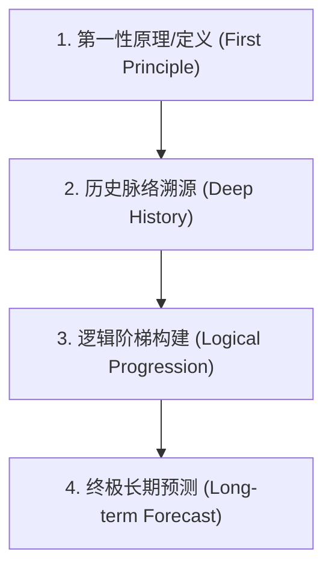

# 李录（Li Lu）的语言与表达 DNA 研究报告

本研究旨在解构价值投资者、喜马拉雅资本（Himalaya Capital）创始人李录的语言表达特征、修辞修辞学、核心词汇库及叙事结构，为“李录思维操作系统”提供语言表达层面的高保真还原基础。

---

## 一、 语言表达的总体基调 (General Expression Tone)

李录的公开表达（包括其著作、演讲及深度访谈）展现出一种极具辨识度的“学者型投资者”气度。其核心基调可概括为：**冷静、高度理性、温和、精确、充满知识分子感**。

### 1. 冷静与测量感 (Calmness & Measured Cadence)
李录极少使用煽动性、情绪化或夸张的修辞。在面对宏观变局（如中美关系、全球信用收缩）时，他倾向于用客观的概率和长周期视角来淡化短期的恐慌或狂热。他的语气缓慢而笃定，常用中性句式来陈述事实。
*   *表现形式*：句子结构完整，修饰词较少，多用陈述句和条件假设句。
*   *思想根基*：认为投资的本质是客观规律的显现，情绪是认知的敌人。

### 2. 高度理性与跨学科论证 (High Rationality & Interdisciplinary Logic)
他的话语体系不是孤立的金融分析，而是大量借用热力学（熵增与熵减）、演化生物学（基因、共同祖先）、人类学（狩猎文明与农业文明）等硬科学概念。他通过这些科学定理为投资哲学提供底层逻辑支撑。
*   *表现形式*：使用诸如“热力学第二定律”、“生物演化”、“常数”等自然科学术语来类比社会科学现象。

### 3. 温和与谦逊 (Gentle & Intellectual Humility)
李录在演讲中展现出对先贤（如本杰明·格雷厄姆、查理·芒格）的极高敬意，常以“学生”或“同行者”自居。他的反驳或纠偏通常以“从另一个维度来看”、“如果我们拉长时间尺度”等温和词汇切入，避免直接的冲突性表达。

### 4. 精确与数学化思维 (Precision & Mathematical Precision)
他对概念的定义要求极高，反对模糊和似是而非的表述。在讨论投资回报或文明演进时，他总会引入“复利公式”、“概率分布”或“边际成本”等具有量化意味的表达。

---

## 二、 表达的结构 DNA (Structural DNA of Statements)

李录在阐述复杂观点时，几乎总是遵循一套**“第一性原理出发 $\rightarrow$ 历史演化溯源 $\rightarrow$ 逻辑递进推演 $\rightarrow$ 长期趋势预测”**的四段式叙事链条。



### 案例剖析：李录对“科技文明（3.0文明）”的论述结构

| 结构步骤 | 论述内容与逻辑展开 | 表达特征 |
| :--- | :--- | :--- |
| **1. 定义/第一性原理** | 明确现代文明（3.0文明）的定义：**自由市场机制**与**现代科技**的结合。其本质是让产品种类无限增多、成本无限下降，与人类的无限需求相结合。 | 以严谨的学术定义切入，排除一切政治或道德干扰，直击物理与经济学本质。 |
| **2. 历史脉络溯源** | 回溯人类1.6万年的文明史：1.0狩猎采集文明（受制于自然摄取能力） $\rightarrow$ 2.0农业文明（以土地为核心，受制于光合作用上限，落入马尔萨斯陷阱）。 | 引入超长历史尺度（Deep History），展现宏大背景，使当下的现象显得不再孤立。 |
| **3. 逻辑阶梯构建** | **递进一**：当现代科技与自由市场结合，分工创造财富，知识可以积累；<br>**递进二**：知识的积累性导致“1+1 > 4”的碰撞，使得技术成倍放大；<br>**递进三**：当这种机制运转，经济体便进入自动的、永续的“复利增长”状态。 | 采用“如果……那么……因为……”的严密因果链条，层层递进，不留逻辑断层。 |
| **4. 终极长期预测** | 3.0文明下的全球市场必然是一个整体。任何脱离全球自由贸易体系的国家都将走向相对落后。中国在完成工业化（进入2.5阶段）后，必须向依赖制度信托、法治及科学思维的3.0文明完全过渡。 | 给出确定性的长周期结论（跨度通常为几十年甚至上百年），忽视短期波动。 |

---

## 三、 高频核心词汇库 (High-Frequency Vocabulary)

李录的表达中存在一组具有高黏性的核心词汇，这些词汇是他构建思维模型的基石。

| 核心词汇 (中/英) | 概念内涵 | 典型用法/原句重现 |
| :--- | :--- | :--- |
| **知识的诚实**<br>(Intellectual Honesty) | 在认知上完全坦诚，明确界定知与不知的边界，杜绝自欺欺人。这是价值投资的道德责任与生存基石。 | “做这个行业最根本的要求，是一定要在知识上做完完整整、百分之百诚实的人。” |
| **复利**<br>(Compound Interest) | 不仅指财务上的利滚利，更指人类知识的累进式增长以及现代化经济的永续增长特征。 | “现代文明的本质是科学技术与自由市场的结合，这导致了人类历史上第一次出现永续的复利增长。” |
| **能力圈**<br>(Circle of Competence) | 投资者能够做出高概率正确预测的知识和行业边界。强调“边界的严苛性”重于“圈子的大小”。 | “能力圈的边界是由知识的诚实来画定的。超出能力圈一步，就是悬崖。” |
| **商道**<br>(Way of Business) | 企业的经营道德与长期正向循环的社会价值，主张通过增进社会福祉来获得财富。 | “真正的商道是正道，是通过创造新财富实现共赢，而不是在零和博弈中掠夺。” |
| **普世性 / 共同性**<br>(Universality / Commonality) | 人类演化史所决定的基本人性、科学方法的普适性，以及全球大市场不可分割的特征。 | “3.0文明具有普世性。在全球化大市场中，没有任何国家可以长期独立于这个体系之外而保持领先。” |
| **真理**<br>(Truth) | 客观世界运行的客观规律。投资就是寻找主观认知与客观真理的最大程度重合。 | “我们做投资，就是为了接受世界本来的样子，寻找事实与真理，而不是寻找我们希望的样子。” |
| **熵减**<br>(Entropy Reduction) | 借用物理学概念，形容价值投资通过合理配置资源、支持优秀企业，从而对抗社会和市场混乱的过程。 | “正道上的价值投资，实际上是一个人在商业和社会中进行‘熵减’的旅程。” |
| **如其所是**<br>(As it is) | 摒弃个人偏见和情绪，坦然接受客观事实的本质面貌。 | “接受世界本来的样子，而非我们所希望的，也非我们所想要的。一切如其所是。” |

---

## 四、 核心名言与概念辨析 (Key Quotes & Contradictions)

### 1. 关于“诚实”的底层逻辑
> **经典语录**：“做这个行业最根本的要求，是一定要在知识上做完完整整、百分之百诚实的人。因为这个行业最好骗的是自己，而市场是一个专门发现你人性弱点并加以放大的机制。如果不诚实，最终一定会以非常惨烈的方式被市场彻底毁掉。”
> —— *源自：李录2019年北京大学光华管理学院演讲《价值投资的知行合一》（一手货源）*

*   **修辞分析**：使用“百分之百”、“做完完整整”等绝对性限定词来强调原则的不可妥协性；用“彻底毁掉”、“惨烈”等警示性词汇与前述的理性温和形成强烈对比，表明这是生存底线。
*   **思想延伸**：这与查理·芒格的“第一条原则是不要愚弄自己，而你是最容易被愚弄的人”高度一致。

### 2. 关于“现代化是人类历史的常态”的认知冲突与辩证
> **争议/冲突点**：在日常话语中，人们常将“现代化”视作理所当然的历史常态。但在大历史视角下，这构成了一个深刻的**认知矛盾**：

```
                    【关于现代化常态的辩证认知】
                                 │
         ┌───────────────────────┴───────────────────────┐
         ▼                                               ▼
【宏观长周期历史视角 (非常态)】                  【3.0科技文明范式视角 (常态)】
 - 放在人类1.6万年的尺度上                       - 一旦进入3.0文明，理性思维、科学
 - 停滞、波动、马尔萨斯陷阱是常态                 方法和自由市场成为底层操作系统
 - 持续复利增长是近200年罕见的"奇迹"            - 经济永续增长和现代化成为新的"常态"
```

*   **大历史维度的“非常态”**：
    李录在《文明、现代化、价值投资与中国》中明确指出，在人类一万六千年的记载里，长期的复利增长和繁荣**从来都不是历史的常态**。农业文明时期的常态是“繁荣—马尔萨斯危机—崩溃”的循环，停滞是历史的常态。
*   **范式转移后的“新常态”**：
    然而，一旦人类通过启蒙运动确立了理性思维、科学方法和思想的自由市场，这三者就成为了3.0科技文明的**新常态**。在这个范式下，现代化的复利增长机制开始自动运转，现代科技与自由市场的结合使得现代化成为了不可逆的、具有普世意义的常态趋势。
*   **矛盾的统一**：
    李录的表达魅力在于，他能同时持有这两种看似矛盾的观点：他以“非常态”的视角警醒世人现代化增长的脆弱与珍贵，又以“常态”的视角预测全球市场融合与科技进步的必然未来。

---

## 五、 信息源分类与可信度评估

为确保研究的严谨性，本报告排除了知乎、微信公众号、百度百科等非专业、易受二次加工干扰的渠道，仅采用以下高可信度的一手与二手文献。

### 1. 一手信息源 (Primary Sources) - 极高可信度
*   **著作**：李录著，《文明、现代化、价值投资与中国》，中信出版集团，2020年。
    *   *评估*：李录亲自撰写与校对的演讲合集，系统展现其语言DNA和“现代化十六讲”的逻辑脉络。
*   **高校及官方演讲实录**：
    *   2015年北京大学光华管理学院演讲：《价值投资在中国的展望》。
    *   2019年北京大学光华管理学院演讲：《价值投资的知行合一》。
    *   2024年北京大学光华管理学院十周年沙龙演讲：《全球价值投资与时代》。
    *   *评估*：现场录音转写稿，保留了其口语化表达中高频出现的语气助词、过渡句式和现场答问的即兴思维逻辑。
*   **学术/投资机构专访**：
    *   哥伦比亚大学商学院《Graham & Doddsville》Newsletter 专访（英文原文）。
    *   喜马拉雅资本（Himalaya Capital）官方发布的研究备忘录与致股东信。

### 2. 二手信息源 (Secondary Sources) - 中高可信度
*   **财经媒体深度报道**：
    *   《Caixin (财新网)》关于李录参与芒格纪念活动及中国价值投资发展的专访与报道。
    *   《36Kr (36氪)》、《Huxiu (虎嗅网)》对李录演讲稿的校对整理版。
    *   《Futu News (富途资讯)》及《Eastmoney (东方财富)》整理的李录价值投资金句集。
    *   *评估*：经过财经编辑的系统整理，剔除了多余的口头禅，使得金句的结构更加紧凑，但在一定程度上弱化了李录原汁原味的学术语感。
